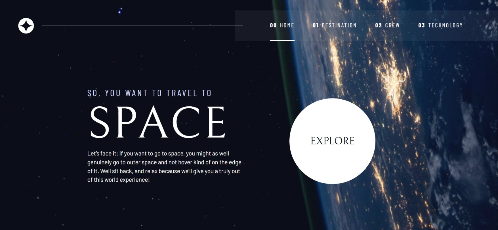
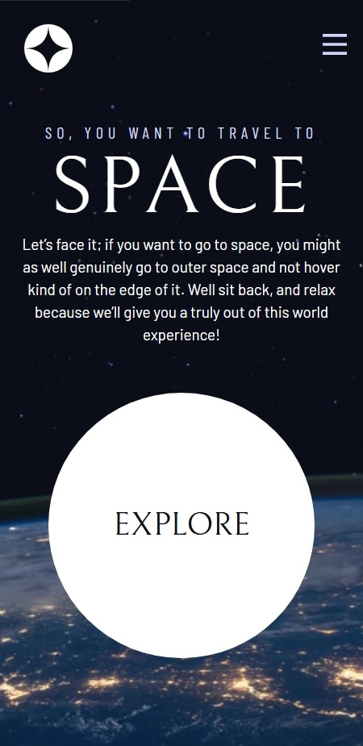

# Frontend Mentor - Space tourism website solution

This is a solution to the [Space tourism website challenge on Frontend Mentor](https://www.frontendmentor.io/challenges/space-tourism-multipage-website-gRWj1URZ3). Frontend Mentor challenges help you improve your coding skills by building realistic projects.

## Table of contents

- [Overview](#overview)
  - [The challenge](#the-challenge)
  - [Screenshot](#screenshot)
  - [Links](#links)
- [My process](#my-process)
  - [Built with](#built-with)
  - [What I learned](#what-i-learned)
  - [Continued development](#continued-development)
  - [Useful resources](#useful-resources)
- [Author](#author)
- [Acknowledgments](#acknowledgments)

## Overview

### The challenge

Users should be able to:

- View the optimal layout for each of the website's pages depending on their device's screen size
- See hover states for all interactive elements on the page
- View each page and be able to toggle between the tabs to see new information

### Screenshot




### Links

- Solution URL: [https://github.com/MrRyt247/space-tourism-website](https://github.com/MrRyt247/space-tourism-website)
- Live Site URL: [https://mrryt247.github.io/space-tourism-website/](https://mrryt247.github.io/space-tourism-website/)

## My process

### Built with

- Semantic HTML5 markup
- CSS custom properties
- Flexbox
- CSS Grid
- Mobile-first responsive design
- CSS animations and transitions
- Vanilla JavaScript
- ES6 Modules
- JSON data management
- Accessible keyboard navigation

### What I learned

This project reinforced several key concepts in modern web development, particularly around creating smooth user interactions and maintaining accessibility:

- Dynamic Content Management:

```js
function transitionContent(updateFunction) {
  destinationArticle.classList.add("content-fade-out");
  setTimeout(() => {
    updateFunction();
    destinationArticle.classList.remove("content-fade-out");
    destinationArticle.classList.add("content-entering");
  }, 150);
}
```

- Accessible Tab Navigation:

```js
handleKeydown(event) {
  const { key } = event;
  const prevKey = this.isVertical ? "ArrowUp" : "ArrowLeft";
  const nextKey = this.isVertical ? "ArrowDown" : "ArrowRight";
}
```

The most valuable learning was implementing smooth content transitions that maintain performance while providing visual feedback. The combination of CSS transitions for immediate UI feedback and JavaScript coordination for content updates creates a professional user experience.

### Continued development

- Performance Optimization: Implementing lazy loading for images and optimizing animation performance for lower-end devices
- Advanced Animations: Exploring more sophisticated transition effects using CSS transforms and custom timing functions
- State Management: Investigating more robust state management patterns for complex multi-page applications
- Progressive Enhancement: Ensuring full functionality even when JavaScript fails to load

### Useful resources

- [ARIA Authoring Practices Guide](https://www.w3.org/WAI/ARIA/apg/) - Invaluable for implementing accessible tab interfaces with proper keyboard navigation
- [Scrimba](https://scrimba.com/build-a-space-travel-website-c014) - For making a comprehensive tutorial in building this website

## Author

- Frontend Mentor - [@MrRyt247](https://www.frontendmentor.io/profile/MrRyt247)
- GitHub - [MrRyt247](https://github.com/MrRyt247/MrRyt247)

## Acknowledgments

- Kevin Powell - [Scrimba's Tutorial](https://scrimba.com/build-a-space-travel-website-c014)
